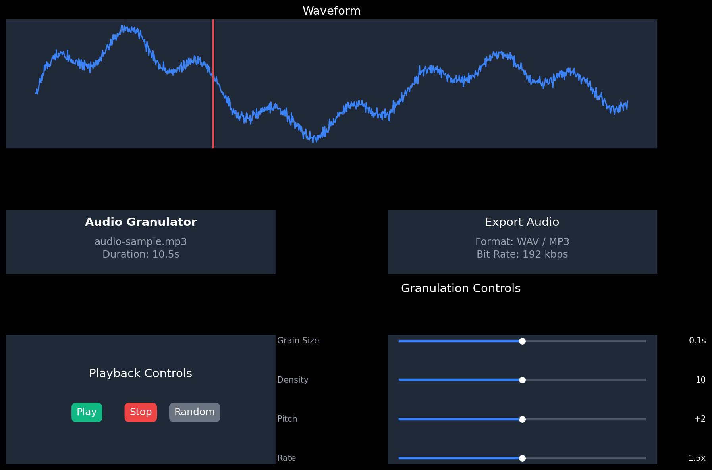

# Audio Granulator

A browser-accessible audio granulator application that allows users to upload and transform audio files via granular synthesis with real-time controls.



## Features

- **Granular Synthesis**: Transform audio using granular synthesis techniques
- **Real-time Controls**: Adjust parameters like grain size, density, pitch, and playback rate in real-time
- **Waveform Visualization**: See your audio file's waveform and playback position
- **Zen Mode**: Immersive particle visualization that responds to audio parameters
- **Random Presets**: Generate random parameter combinations for creative exploration
- **Export Functionality**: Save your processed audio as WAV or MP3 files
- **Responsive Design**: Works on desktop and mobile devices

## What is Granular Synthesis?

Granular synthesis is a sound synthesis method that operates on the microsound time scale. It involves breaking down audio samples into tiny grains (typically 1 to 100 milliseconds) and then manipulating and recombining these grains to create new sounds. This technique allows for unique transformations that aren't possible with traditional synthesis methods.

## Installation

### Prerequisites

- Node.js (v16 or higher)
- npm or yarn

### Setup

1. Clone the repository:
   ```bash
   git clone https://github.com/yourusername/audio-granulator.git
   cd audio-granulator
   ```

2. Install dependencies:
   ```bash
   npm install
   # or
   yarn install
   ```

3. Start the development server:
   ```bash
   npm run dev
   # or
   yarn dev
   ```

4. Open your browser and navigate to `http://localhost:5173`

## Usage Guide

### Basic Operation

1. **Upload Audio**: Click the "Choose File" button to upload an audio file (MP3 or WAV)
2. **Play/Stop**: Use the play and stop buttons to control audio playback
3. **Adjust Parameters**: Use the sliders and knobs to modify the granular synthesis parameters
4. **Export**: Click the "Export" button to save your processed audio

### Granular Synthesis Parameters

- **Grain Size**: Controls the duration of each grain (0.01s to 1s)
- **Grain Density**: Sets how many grains are played per second (1 to 100)
- **Pitch Shift**: Adjusts the pitch of grains (-12 to +12 semitones)
- **Playback Rate**: Changes the speed of playback (0.25x to 4x)
- **Playback Position**: Sets the position in the audio file where grains are sourced
- **Position Variation**: Adds randomness to the playback position
- **Attack Time**: Controls how quickly each grain fades in
- **Release Time**: Controls how quickly each grain fades out

### Advanced Features

#### Random Presets

Click the "Random Preset" button to generate random parameter combinations. This is a great way to discover new sounds and textures.

#### Zen Mode

Toggle between standard waveform visualization and Zen Mode, which displays an immersive particle visualization that responds to your audio parameters:

- Particle colors change with pitch shift
- Particle movement speed corresponds to playback rate
- Particle density relates to grain density
- Particle size relates to grain size

#### Export Options

1. Click the settings icon in the Export panel
2. Choose your preferred format (WAV or MP3)
3. For MP3, select your desired bit rate
4. Enter a filename
5. Click "Export" to download your processed audio

## Deployment

### GitHub Pages

1. Update the `vite.config.js` file:
   ```javascript
   export default defineConfig({
     base: '/audio-granulator/',
     // other config...
   });
   ```

2. Build the project:
   ```bash
   npm run build
   ```

3. Deploy to GitHub Pages:
   ```bash
   npm run deploy
   ```

### Vercel or Netlify

1. Connect your GitHub repository to Vercel or Netlify
2. Configure the build settings:
   - Build command: `npm run build`
   - Output directory: `dist`
3. Deploy

## Technical Details

### Technologies Used

- **React**: Frontend framework
- **Tone.js**: Audio processing and granular synthesis
- **Tailwind CSS**: Styling and responsive design
- **HTML5 Canvas**: Waveform and particle visualization

### Project Structure

```
audio-granulator/
├── public/                    # Static assets
│   ├── favicon.ico
│   └── index.html
├── src/                       # Source code
│   ├── components/            # React components
│   │   ├── AudioControls/     # Control components (knobs, sliders)
│   │   ├── Granulator/        # Core granulator component
│   │   ├── Visualizer/        # Audio/particle visualization
│   │   └── UI/                # General UI components
│   ├── hooks/                 # Custom React hooks
│   │   └── useAudioGranulator.js  # Main audio processing hook
│   ├── utils/                 # Utility functions
│   │   └── audio/             # Audio processing utilities
│   ├── App.jsx                # Main application component
│   └── index.jsx              # Entry point
├── README.md                  # Project documentation
└── package.json               # Dependencies and scripts
```

## License

MIT License

## Acknowledgements

- [Tone.js](https://tonejs.github.io/) for the audio processing capabilities
- [React](https://reactjs.org/) for the UI framework
- [Tailwind CSS](https://tailwindcss.com/) for styling